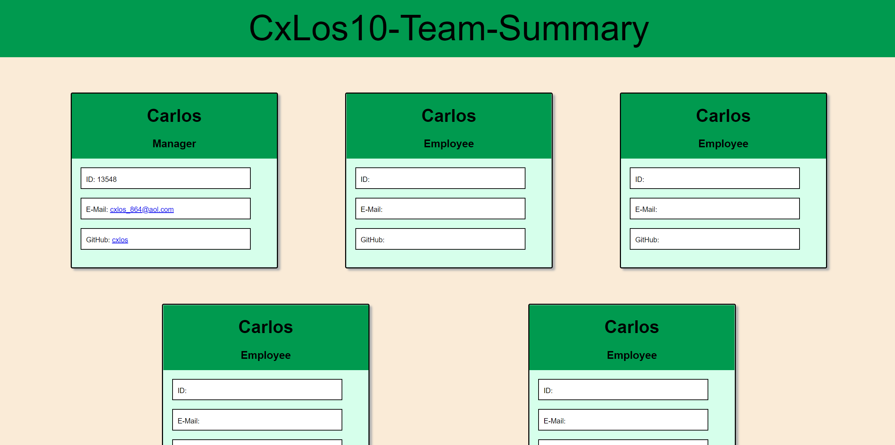

#  CxLos10-Team-Summary

## Description

The motivation behind constructing this application is to be able to neatly organize team members' info all in one document. This application is designed to solve issues with organization so that a manager can better keep track of their records. working on this project, I learned how to use the command line to prompt me to answer questions and then when I answer those questions, an html document is generated. I also learned how to implement testing into my project to test the functionality of my code.

## Table of Contents

- [Installation](#installation)
- [Usage](#usage)
- [Credits](#credits)
- [License](#license)
- [Badges](#badges)
- [Features](#features)
- [Tests](#tests)

## Installation

[Please watch video](https://drive.google.com/file/d/12bkddflo-5NdVi8bj5n5tzYeCvQke3_K/view)

## Usage

[CxLos10 Team Summary](https://cxlos.github.io/Cxlos10-Team-Summary/)

## Badges

N/A

## Features

N/A

## How to Contribute

N/A

## Tests

N/A

## Credits

N/A

## License

MIT License

Copyright (c) 2022 CxLos

Permission is hereby granted, free of charge, to any person obtaining a copy
of this software and associated documentation files (the "Software"), to deal
in the Software without restriction, including without limitation the rights
to use, copy, modify, merge, publish, distribute, sublicense, and/or sell
copies of the Software, and to permit persons to whom the Software is
furnished to do so, subject to the following conditions:

The above copyright notice and this permission notice shall be included in all
copies or substantial portions of the Software.

THE SOFTWARE IS PROVIDED "AS IS", WITHOUT WARRANTY OF ANY KIND, EXPRESS OR
IMPLIED, INCLUDING BUT NOT LIMITED TO THE WARRANTIES OF MERCHANTABILITY,
FITNESS FOR A PARTICULAR PURPOSE AND NONINFRINGEMENT. IN NO EVENT SHALL THE
AUTHORS OR COPYRIGHT HOLDERS BE LIABLE FOR ANY CLAIM, DAMAGES OR OTHER
LIABILITY, WHETHER IN AN ACTION OF CONTRACT, TORT OR OTHERWISE, ARISING FROM,
OUT OF OR IN CONNECTION WITH THE SOFTWARE OR THE USE OR OTHER DEALINGS IN THE
SOFTWARE.
